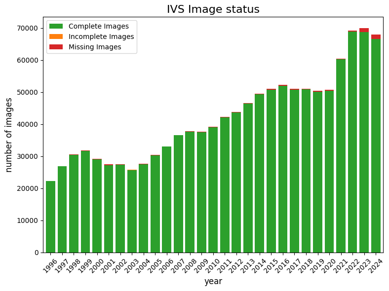
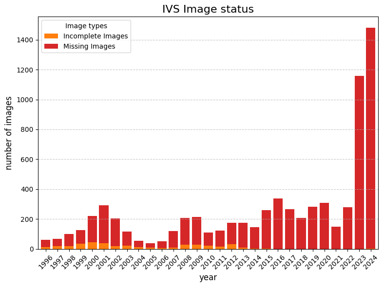

# IVS 資料狀態統計

統整每年 IVS (Implied Volatility Surface) 網格資料的完整度狀態。
- **Complete Images**: 網格內所有 180 (days * delta) 個數值皆完整且無 `NaN`。
- **Incomplete Images**: 網格內有 1~179 個數值為 `NaN` (部分缺值)。
- **Missing Images**: 網格內所有 180 個數值皆為 `NaN` (全面缺值)。

## 各年度統計表

|   Year |   Complete Images |   Incomplete Images |   Missing Images |
|-------:|------------------:|--------------------:|-----------------:|
|   1996 |             22244 |                  13 |               49 |
|   1997 |             26834 |                  19 |               49 |
|   1998 |             30489 |                  18 |               82 |
|   1999 |             31677 |                  36 |               90 |
|   2000 |             28992 |                  45 |              175 |
|   2001 |             27153 |                  38 |              253 |
|   2002 |             27381 |                  19 |              186 |
|   2003 |             25732 |                  22 |               95 |
|   2004 |             27546 |                  11 |               45 |
|   2005 |             30323 |                  10 |               29 |
|   2006 |             33054 |                   5 |               45 |
|   2007 |             36547 |                  10 |              110 |
|   2008 |             37649 |                  28 |              181 |
|   2009 |             37472 |                  30 |              185 |
|   2010 |             39075 |                  21 |               89 |
|   2011 |             42173 |                  15 |              108 |
|   2012 |             43642 |                  31 |              143 |
|   2013 |             46449 |                  10 |              164 |
|   2014 |             49413 |                   2 |              144 |
|   2015 |             50803 |                   1 |              259 |
|   2016 |             51962 |                   0 |              338 |
|   2017 |             50830 |                   0 |              266 |
|   2018 |             50897 |                   0 |              208 |
|   2019 |             50192 |                   0 |              283 |
|   2020 |             50424 |                   0 |              308 |
|   2021 |             60226 |                   0 |              149 |
|   2022 |             68906 |                   0 |              279 |
|   2023 |             68826 |                   0 |             1158 |
|   2024 |             66540 |                   1 |             1479 |

## 各年度 IVS 資料整體完整度分佈

這張圖表展示了每年完整的 IVS 面板與出現缺漏（部分或全部為 NaN）面板的整體比例。

## 各年度 IVS 缺漏面板數量趨勢

由於完整的面板數量龐大，此圖特別將「部分缺值 (Incomplete)」與「全面缺值 (Missing)」獨立出來，方便觀察異常數據的年份分佈與變化趨勢。

